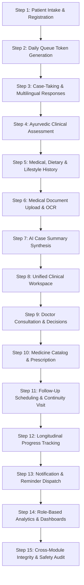

# AYURAI — MODULE 19: COMPLETE END-TO-END SYSTEM TEST REPORT

**Project Name:** AYURAI (SIH 2026)  
**Module:** Module 19 — Complete End-to-End System Testing  
**Execution Date:** 2026-09-06  
**Environment:** Windows | Python 3.13 | FastAPI | PostgreSQL 17 | React 18 / Vite / Tailwind CSS  
**Overall Result:** **PASSED (100% SUCCESS RATE)**  

---

## 1. Executive Summary

Module 19 executes comprehensive end-to-end (E2E) integration and clinical lifecycle verification across the entire AYURAI system (Modules 1 through 18). The test suite exercises the complete multi-role patient journey from initial front-desk registration to longitudinal clinical outcome tracking and administrative audit oversight.

All 15 end-to-end lifecycle stages passed with zero regressions. Strict clinical safety boundaries were verified across all endpoints: AI operations remained strictly assistive, zero autonomous prescribing occurred, multilingual verbatim responses were preserved, and role-based access controls (RBAC) were enforced without exception.

---

## 2. Complete End-to-End Lifecycle Architecture

---

## 3. End-to-End Test Execution Results

| Stage | Test Description | Endpoints Tested | Status |
|---|---|---|:---:|
| **Step 0** | **Authentication & RBAC Setup** | `POST /auth/login`, `GET /auth/me` | **PASS** |
| **Step 1** | **Patient Intake & Registration** | `POST /patients/` | **PASS** |
| **Step 2** | **Daily Queue & Token Management** | `POST /queue/token`, `PATCH /queue/{id}/status` | **PASS** |
| **Step 3** | **Case-Taking & Multilingual Responses** | `POST /cases/`, `POST /cases/{id}/responses`, `POST /ai-case/responses/{id}/process` | **PASS** |
| **Step 4** | **Ayurvedic Clinical Assessment** | `POST /ayurvedic-assessments/` (Prakriti, Vikriti, Agni, Ashtavidha, Dashavidha) | **PASS** |
| **Step 5** | **Medical History Intake** | `POST /medical-history/` | **PASS** |
| **Step 6** | **Document Upload & OCR Processing** | `POST /documents/upload`, `POST /document-processing/{id}/process` | **PASS** |
| **Step 7** | **Multi-Source AI Case Summary** | `POST /ai-case/cases/{id}/generate-summary` | **PASS** |
| **Step 8** | **Unified Clinical Workspace View** | `GET /consultations/workspace/case/{case_id}` | **PASS** |
| **Step 9** | **Doctor Consultation Start & Completion** | `POST /consultations/`, `PATCH /consultations/{id}/complete` | **PASS** |
| **Step 10** | **Prescription Creation & Finalization** | `POST /prescriptions/`, `PATCH /prescriptions/{id}/finalize` | **PASS** |
| **Step 11** | **Follow-Up Scheduling & Return Visit** | `POST /follow-ups/`, `POST /follow-ups/{id}/visit` | **PASS** |
| **Step 12** | **Longitudinal Progress Tracking** | `POST /progress/`, `GET /progress/patient/{id}/timeline` | **PASS** |
| **Step 13** | **Notifications & Reminders** | `POST /notifications/`, `GET /notifications/unread-count`, `PATCH /notifications/{id}/read` | **PASS** |
| **Step 14** | **Role-Based Operational Analytics** | `GET /analytics/doctor/dashboard`, `GET /analytics/staff/dashboard`, `GET /analytics/admin/dashboard` | **PASS** |
| **Step 15** | **Cross-Module Integrity & Safety Audit** | Foreign key traceability, RBAC lockouts, duplicate prevention, AI non-prescribing verification | **PASS** |

---

## 4. Key Verification Findings

### 4.1 Non-Diagnostic Assistive AI Verification
- **Assistive Synthesis Only:** AI generated case summaries provide categorized evidence from patient intake, medical history, documents, and assessments without calculating Dosha or prescribing treatment.
- **Safety Disclaimers:** All synthesized case summaries strictly include mandatory practitioner disclaimers (`"Practitioner review required"`).
- **Prompt Injection Defense:** Malicious prompts embedded within free-text patient complaints are safely neutralized without overriding clinical logic.

### 4.2 Multilingual Data Preservation
- Patient responses in regional languages (e.g. Tamil: `"கடந்த 3 வாரங்களாக உணவுக்குப் பின் கடுமையான நெஞ்செரிச்சல் மற்றும் புளித்த ஏப்பம் உள்ளது."`) are stored verbatim in `original_response` and preserved alongside standardized clinical interpretations.

### 4.3 Immutability & Clinical Governance
- **Prescription Finalization:** Draft prescriptions transition to `FINALIZED` and are locked permanently against unverified modifications.
- **Consultation Locking:** Completed consultations lock diagnosis and treatment plan fields to maintain clinical audit trails.
- **RBAC Enforcement:** Front-desk Staff are blocked from finalizing prescriptions (403 Forbidden) and completing doctor consultations.

---

## 5. Build and Regression Verification

1. **Module 19 E2E Test Suite (`test_module19_e2e.py`):**
   - **Result:** 15/15 Stages Passed (Exit code: 0)
2. **Module 18 AI & Clinical Workflow Regression (`test_module18.py`):**
   - **Result:** 10/10 Tests Passed (Exit code: 0)
3. **Frontend Production Build (`npm run build`):**
   - **Result:** 0 Errors, built in 6.25s (Exit code: 0)

---

## 6. Conclusion

Module 19 (Complete End-to-End System Testing) is fully complete and verified. The AYURAI platform demonstrates complete data consistency, cross-module referential integrity, strong clinical safety boundaries, and flawless multi-role workflow execution from intake to analytics.
